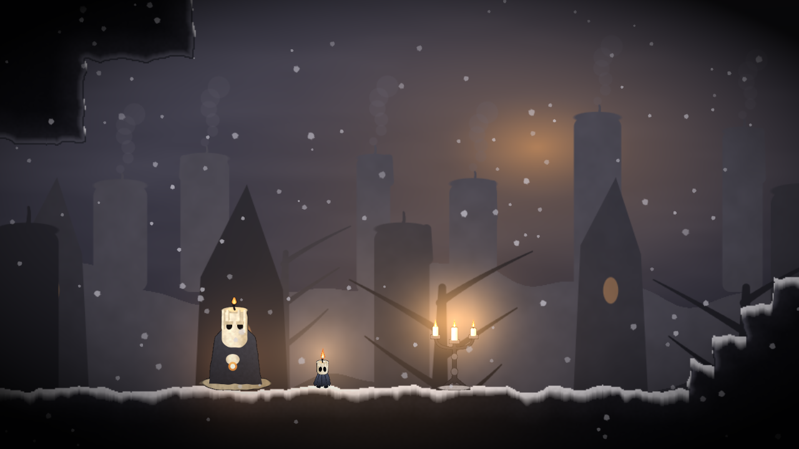
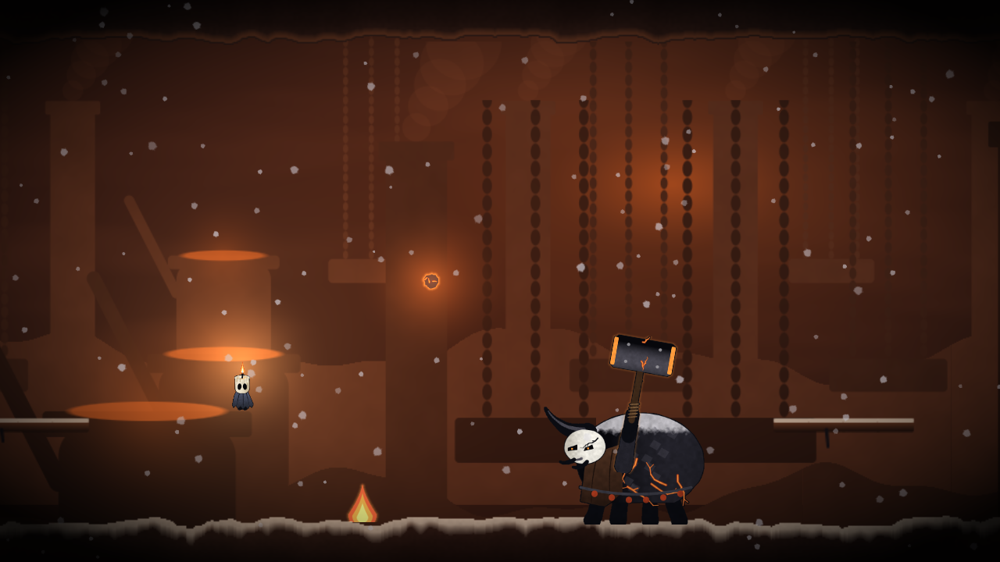
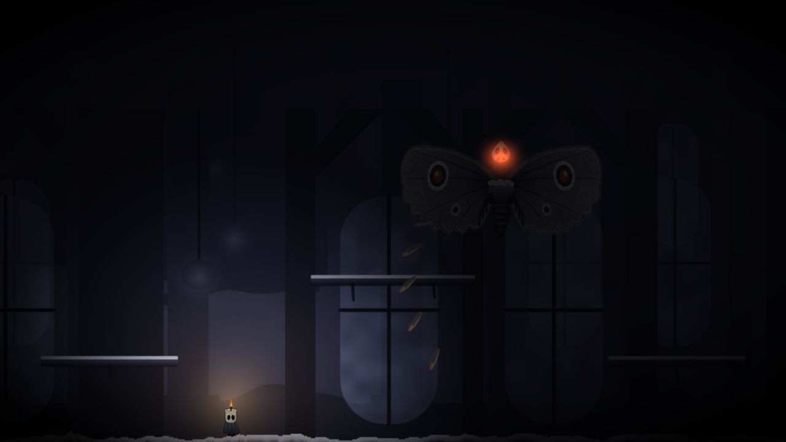
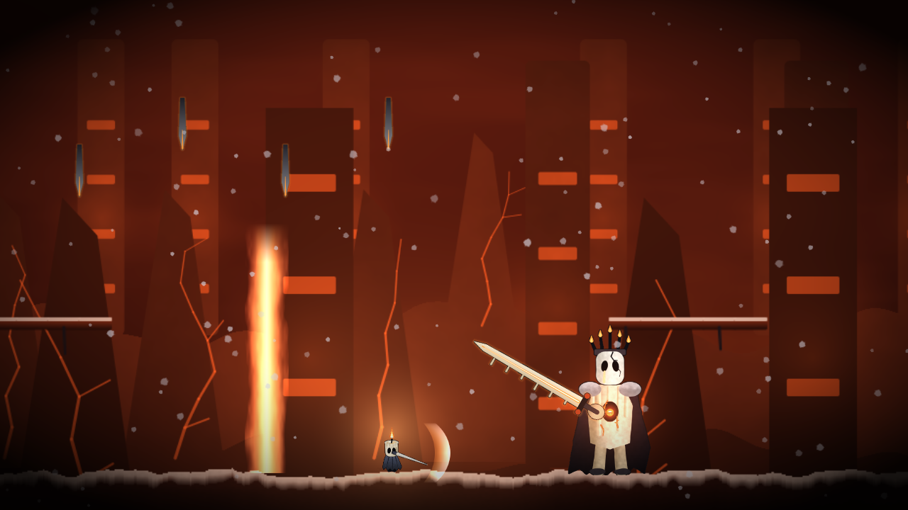

# Hollow Knight: ПЕПЕЛ — Часть III · «Пепельный Фитиль»

**Разработчик: Team Raspberry** · фанатское продолжение Hollow Knight на Unity

> Давным-давно, когда Сияние было запечатано в Халлоунесте, одно её перо упало далеко на восток и не погасло.
> Из него разгорелся Великий Горн… Когда отдавать огню стало нечего, пошёл пепел. Он падает до сих пор.
> Свечная Мать отлила последнего свечка. Маленького. Тёплого. Его звали **Нив**.



| Горнан, Угольный Кузнец | Морра, Ткачиха Сажи (фаза «Затмение») | Таллоу, Король-Огарок |
|---|---|---|
|  |  |  |

Скриншоты собраны из того же процедурного арта, что рисует игра (`Docs/Screenshots`, лист спрайтов — `sprite_sheet.png`).

---

## Как запустить

1. Установите **Unity 2022.3 LTS** (подойдёт и 2021.3+ или Unity 6).
2. В Unity Hub: **Add → Add project from disk** → выберите папку репозитория.
3. Откройте сцену `Assets/Scenes/Main.unity` (откроется автоматически) и нажмите **Play**.

Игра не требует настройки сцены, префабов или импорта ассетов: всё — графика, звук, музыка,
уровни и интерфейс — создаётся кодом при запуске (`AshenWick.Boot` стартует игру в любой сцене).
Для сборки: **File → Build Settings → Build** (сцена `Main` уже добавлена).

Меню редактора **Ashen Wick** → *Open Main Scene* / *Erase Save Data*.

## Управление

| Действие | Клавиатура | Геймпад |
|---|---|---|
| Движение | ← → / A D | левый стик |
| Прыжок (держать — выше) | Z / Пробел / K | A |
| Удар (↑ — вверх, ↓ в воздухе — вниз, пого) | X / J | X |
| Рывок *(после алтаря в Шраме)* | C / Shift / L | RB |
| **Вспышка** — нажать *(после Горнана)* | F / V / I | B |
| **Переплавка** (лечение) — держать на земле | F / V / I | B |
| Двойной прыжок *(после Морры)* | прыжок в воздухе | A |
| Прочитать / говорить / отдохнуть | ↑ / W | — |
| Спрыгнуть с уступа | ↓ + прыжок | — |
| Пауза | Esc | Start |

Удары по врагам наполняют **сосуд воска**. 33 воска = одна Вспышка или одна сплавленная рана.
Пламя Нива — это его здоровье: чем меньше свечей-жизней, тем меньше свет вокруг него.

## Что внутри

- **Герой Нив** — свечок с живым пламенем: бег, прыжок переменной высоты, койот-тайм и буфер прыжка,
  удары в 4 стороны с отскоком (пого) от врагов и шипов, рывок, двойной прыжок, заклинание,
  лечение, неуязвимость после урона, хитстоп, тряска камеры. Пламя клонится от движения и тускнеет с ранами.
- **4 зоны, 11 комнат**: Пепельные Поля → Воскоплавильни → Собор Угасших → Сердце Горна.
  Параллакс в три слоя, падающий пепел, лава из расплавленного воска, огарки-великаны на горизонте.
- **5 видов врагов**: Пеплоползень, Сажевый мотылёк, Тлеющий страж (таран с копьём),
  Золоплюй (навесные плевки), Искра (подлетает и взрывается).
- **3 босса, у каждого по 3 фазы**, с интро, титульной карточкой, своей музыкой и сценой гибели:
  - **Горнан, Угольный Кузнец** — удары молотом с огненной волной, прыжок-сокрушение, таран в стену
    с оглушением, залпы углей, оставляющие горящие лужи, обвалы с потолка, извержения «Горнила».
  - **Морра, Ткачиха Сажи** — пике по светящейся линии, веера перьев (их можно отбивать ударом),
    кольца сажи, призыв мотыльков, падение на нити с ударом крыльями. Во 2-й фазе гасит свет:
    видны лишь пламя Нива и её горящие глаза.
  - **Таллоу, Король-Огарок** — дуэль (рывок-разрез, тройное комбо, взлёт и пике, огненные волны),
    затем пепельная буря (дождь копий с просветом, восковые столпы, самонаводящиеся угли),
    затем «Угасание»: он парит над ареной и бьёт веерами огненных лучей, кольцами угольков и
    мечами с неба. Последний удар Нив наносит сам.
- **Прогресс**: способности, 3 осколка воска (+1 свеча к максимуму), подсвечники-сохранения,
  скрытая комната, доступная только с двойным прыжком.
- **Процедурный звук**: все эффекты синтезируются, у каждой зоны своя меланхоличная тема,
  у каждого босса — боевая тема. Музыка сочиняется в фоновом потоке.
- **Лор и тексты на русском**: пролог, NPC (Ильва, Свечная Мать и Прах, Летописец), таблички, концовка и титры.

## Структура проекта

```
Assets/
  Scripts/
    Art/       ArtCanvas (SDF-растеризатор), ArtLibrary (весь арт), палитра, шум, кэш, SpriteBank
    Core/      Game (состояния, переходы, смерть), Controls, SaveData, Prewarm
    World/     RoomDefs (карты комнат), Lore (все тексты), Room (сборка уровня), Props
    Player/    Player (Нив)
    Enemies/   Enemies (5 видов + базовый класс)
    Bosses/    Boss (база), Gornan, SootWeaver, CinderKing
    Combat/    Combat + Body (физика по тайлам), Projectile и опасности
    FX/        CameraRig, Fx (частицы), Gfx
    Audio/     Sound (синтез SFX и музыки)
    UI/        Hud (все экраны, IMGUI)
  Resources/   шейдеры AshenWickSprite (вспышка при ударе) и AshenWickAdditive (свечение)
  Editor/      AshenWickSetup (сцена и Build Settings)
  Scenes/      Main.unity
Docs/          скриншоты и лист спрайтов
LORE.md        книга лора: мир, персонажи, бестиарий, разбор боссов
```

Карты комнат — ASCII-строки в `RoomDefs.cs`, легенда описана в комментарии к `RoomDef`.
Новую комнату можно добавить, нарисовав её символами и связав двери через `Link(...)`.

---

*Hollow Knight — торговая марка Team Cherry. Это некоммерческий фанатский проект Team Raspberry.*
